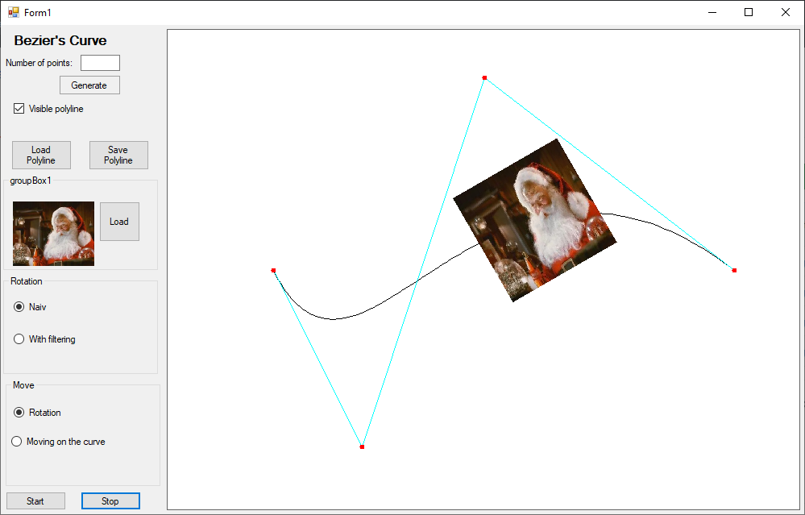

# BezierCurveAndRotation
_Application created as a part of the **Computer graphics 1** course, at the **MINI PW** faculty._

Application contains implementations of naive and by shearing image rotation algorithms.
It also calculates and draws a Bezier curve and animates the image that moves on it.

